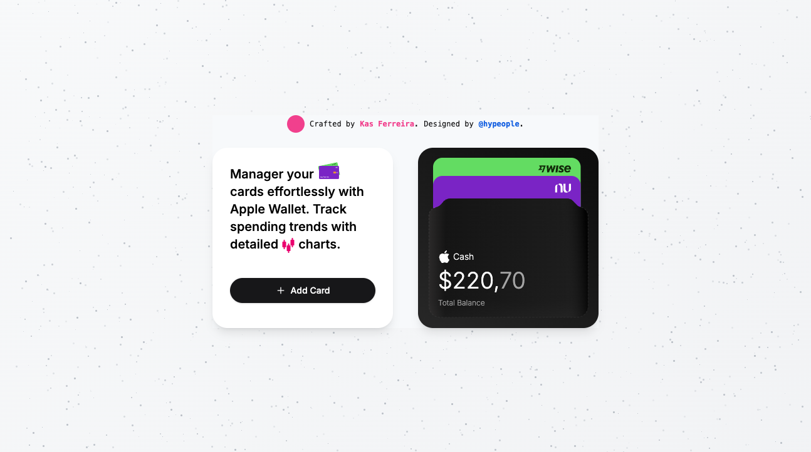

# Kas UI

This monorepo is designed to create showcases of components.

## Components

Component Description Preview
| Component | Description | Preview |
|-----------|-------------|---------|
| MagSafe Wallet Component | A UI component inspired by Apple's MagSafe Wallet and designed by [@hypeople](https://x.com/hypeople). |  |

## What's inside?

- `web`: A Next.js app to showcase components.
- `@repo/eslint-config`: Shared ESLint configurations (includes eslint-config-next and eslint-config-prettier).
- `@repo/typescript-config`: Shared tsconfig.json configurations used throughout the monorepo.

### Build

To build all apps and packages, run the following command:

```
yarn build
```

### Develop

To develop all apps and packages, run the following command:

```
yarn dev
```

## Useful Links

Learn more about the power of Turborepo:

- [Tasks](https://turbo.build/repo/docs/core-concepts/monorepos/running-tasks)
- [Caching](https://turbo.build/repo/docs/core-concepts/caching)
- [Remote Caching](https://turbo.build/repo/docs/core-concepts/remote-caching)
- [Filtering](https://turbo.build/repo/docs/core-concepts/monorepos/filtering)
- [Configuration Options](https://turbo.build/repo/docs/reference/configuration)
- [CLI Usage](https://turbo.build/repo/docs/reference/command-line-reference)
